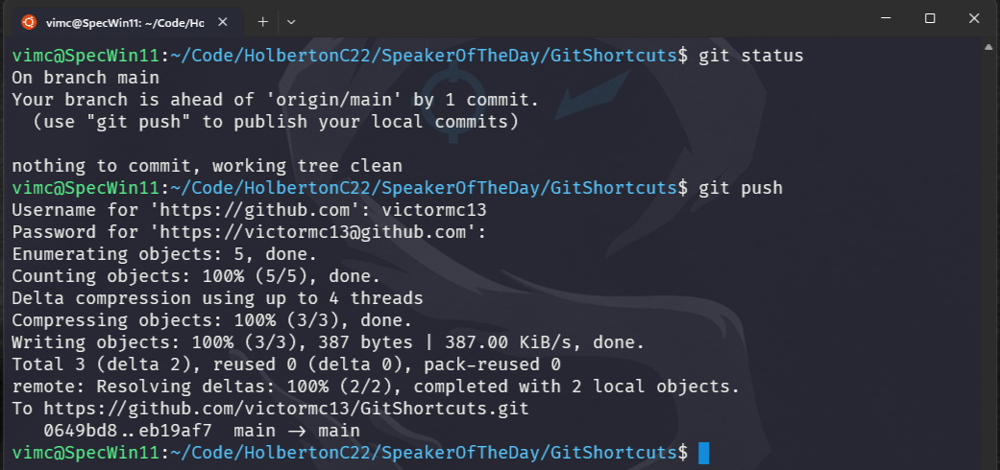
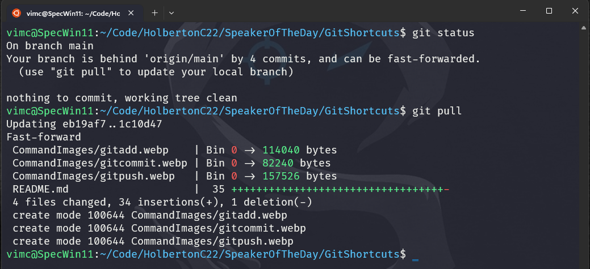

<div align="center">
  <!-- You are encouraged to replace this logo with your own! Otherwise you can also remove it. -->
  
  <br/>

  <h1><b>GitShortcuts</b></h1>

</div>

<!-- PROJECT DESCRIPTION -->

# 📖 [GitShortcuts] <a name="about-project"></a>

<!-- > Describe your project in 1 or 2 sentences. -->

**[GitShortcuts]** repo aims to provide a comprehensive collection of time-saving Git commands and shortcuts that will empower developers to streamline their Git workflows. Whether you're a beginner looking to simplify your Git experience or an experienced developer seeking to boost productivity.

## 🛠 Built With <a name="built-with"></a>

### Tech Stack <a name="tech-stack"></a>

<!-- > Describe the tech stack and include only the relevant sections that apply to your project. -->

  <ul>
    <li>Git</li>
    <li>Vim</li>
    <li>GitHub</li>
  </ul>

### Git basic commands

Shortcuts will improve our productivity and simplify our work. I will let you some of them below:v or if you want more, you can get the full list downloading the pdf [here]()

Example commands:

### **pwd**: First make sure you are in the right directory of your project.

  

### **git init** : Initialize a new Git repository.

  

### **git status** : Show the status of your working directory.

  

### **git add**: Stage changes for commit.
```
git add [filename]
```

  

### **git commit**: Commit staged changes with a message.
```
git commit -m "commit message"
```

  

### **git push**: Push local commits to a remote repository.
>First time you push, you need to set the upstream branch with the following command:
```
git push --set-upstream origin main
```
```
git push
```
>If this case ask for username and password, you should set up your credentials with the following commands, and use your favorite password authentication method (access token, SSH key, etc.):
```
git config --global user.name "your_username"
git config --global user.email "your_email"
```

  

### **git pull**: Pull changes from a remote branch.
```
git pull
```

  
